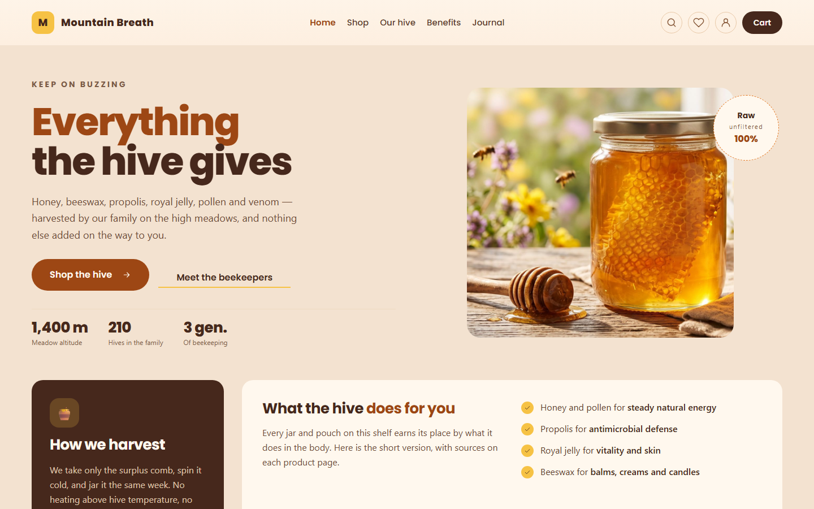
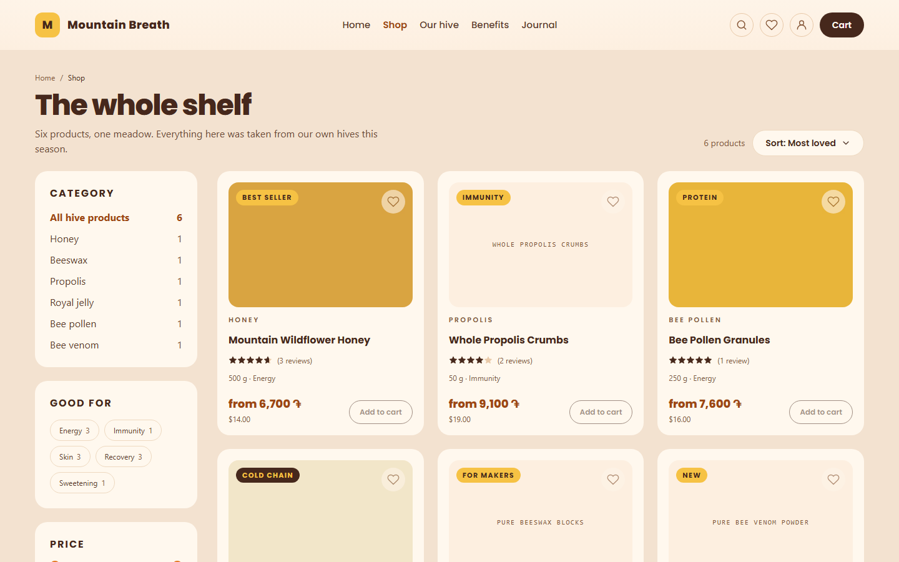
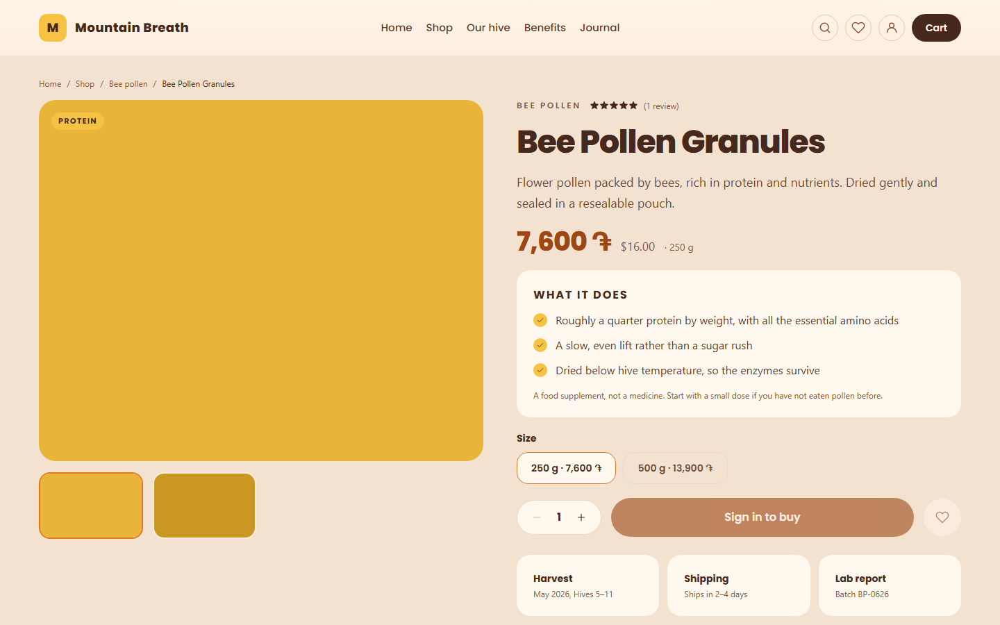
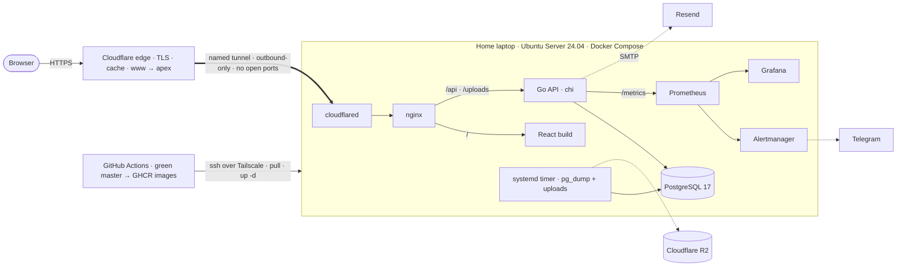

<p align="center">
  <a href="https://mountainbreath.net"></a>
</p>

<h1 align="center">Mountain Breath</h1>

<p align="center">
  A trilingual online shop for a family apiary in Armenia — honey, beeswax, propolis, royal jelly, pollen and bee venom.<br>
  Go, React and PostgreSQL, live at mountainbreath.net, deploying itself from every green <code>master</code>.
</p>

<p align="center">
  <a href="https://mountainbreath.net"></a>
  <a href="https://github.com/Nerses01/Mountain_Breath/actions/workflows/ci.yml"></a>
  
  
  
  
  
  
</p>

<p align="center">
  <a href="https://mountainbreath.net"><b>mountainbreath.net</b></a> &nbsp;·&nbsp;
  <a href="https://mountainbreath.net/hy">Հայերեն</a> &nbsp;·&nbsp;
  <a href="https://mountainbreath.net/ru">Русский</a> &nbsp;·&nbsp;
  <a href="https://mountainbreath.net/api/v1/products">Live API</a> &nbsp;·&nbsp;
  <a href="#architecture">Architecture</a> &nbsp;·&nbsp;
  <a href="#documentation">Docs</a> &nbsp;·&nbsp;
  <a href="#running-it-locally">Run it locally</a>
</p>

<p align="center">
  <a href="https://mountainbreath.net"></a>
</p>

<table>
  <tr>
    <td><a href="https://mountainbreath.net/shop"></a></td>
    <td><a href="https://mountainbreath.net/products/bee-pollen-granules"></a></td>
  </tr>
  <tr>
    <td align="center"><sub>The shop: facets, price slider, two currencies</sub></td>
    <td align="center"><sub>A product page (the tiles are designed placeholders until the family's photography lands)</sub></td>
  </tr>
</table>

## About

The online store of a family apiary in Armenia, live since 2 September 2026 at
[mountainbreath.net](https://mountainbreath.net). Customers shop in English,
Armenian or Russian, see prices in dram or dollars, and pay by bank transfer or
cash on delivery; the family runs the shop from its own back office. The stack
runs on a home server behind a Cloudflare Tunnel, deploys itself from a green
`master`, backs itself up every night, and pages a phone when something breaks.

Every significant technical decision is recorded with its reasoning and date in
the [decisions log](docs/ARCHITECTURE.md#decisions-log) — 110 entries at the
time of writing.

### Storefront

- **Catalog** — categories, products with variants, per-market prices, faceted
  filtering (category, benefit, price range, in stock), sorting, and a hybrid
  search: PostgreSQL full-text over a per-locale generated `tsvector` plus
  `pg_trgm` for prefixes, typos and substrings.
- **Three languages, two currencies** — English at `/`, Armenian at `/hy`,
  Russian at `/ru`; the URL is the single source of truth for language.
  Prices are set by hand per market (AMD and USD) and never converted live;
  minor units are per currency, since a dram has no subdivision.
- **Product pages** — up to three photos and one short video per product,
  editorial content in three languages, related products, and reviews with
  moderation, a verified-purchase rule enforced in the store, and one review
  per person as a database constraint.
- **Cart and checkout** — server-side cart, promo codes with per-market
  amounts, a free-shipping progress bar, a "hive club" derived from order
  count (first order ships free, 8% off after that), server-priced checkout
  with an address book prefill, and VAT extracted from tax-inclusive prices.
- **Payments** — bank transfer and cash on delivery as complete flows: the
  order page and the confirmation email say exactly how to pay, and a cash
  order settles the moment it is marked delivered. Card acquiring waits on
  the family's legal registration ([the paperwork](docs/PAPERWORK_ARMENIA.md)).
- **Content** — six content pages and a journal as markdown in the repo, a
  newsletter with double opt-in whose confirmation is a button press (mail
  scanners prefetch links), and per-page meta, canonical and hreflang tags,
  product JSON-LD, a backend sitemap and robots.txt.

### Accounts

Email registration, Google sign-in, password reset by email, "keep me signed
in", login rate limiting; an account area with order history and a tracker
driven by a real status audit table, reorder and cancel-while-pending,
wishlist with save-for-later, an address book, settings with a password change
that revokes other sessions, a full data export, and account deletion that does
what the privacy page promises. Order and status emails go out in the language
the order was placed in.

### Back office

Products with variants, per-market prices, editorial fields, related products
and media uploads; categories with reordering and empty-only deletion; orders
with a validated status machine and a separate payment-status machine; promo
codes; a review moderation queue; and role management with an "at least one
admin" invariant enforced under row locks.

### Operations

Cloudflare named tunnel (the ISP runs CGNAT, so nothing inbound reaches the
house — the connector dials out, and the host has no open port), continuous
deployment from GitHub Actions over Tailscale, Prometheus + Alertmanager +
Grafana bound to loopback and reached over the tailnet, alerts to Telegram,
nightly `pg_dump` plus an uploads archive with a scripted restore drill and an
off-site copy to Cloudflare R2, and production mail through an SMTP relay with
a conversation deadline so a stalled relay can slow a checkout but never break
one.

## Engineering highlights

The parts a reviewer might want to open first.

- **Checkout is one transaction with ordered row locks** — user row, then
  cart variants, then the promo, then products — so concurrent buyers cannot
  oversell the last jar or redeem a one-per-customer code twice. A
  ten-goroutine race test proves it:
  [`checkout_test.go`](backend/internal/store/checkout_test.go).
- **Money is integer minor units, per currency, balanced by the database.**
  Prices are `(variant, market)` rows; every order satisfies
  `subtotal + shipping − discount = total` through a `CHECK` constraint, and
  one pure function (`domain.Price`) serves the cart page, the checkout
  preview and the charge, so the three cannot disagree.
- **Layering `api → domain ← store`.** The domain package imports neither
  HTTP nor SQL. Store interfaces are declared at the consumer and satisfied
  implicitly, so handler tests run against an in-memory fake with the real
  middleware chain, and repository tests run against a throwaway Postgres
  started by testcontainers.
- **Errors are a contract.** Driver errors become domain sentinels at the
  store boundary; the API maps sentinels to status codes and answers every
  failure in one envelope with machine codes, never English prose — the
  client renders the code in the reader's language, and field keys mirror
  the form (`variants[0].sku`) so errors attach to inputs.
- **Auth the careful way.** Sessions live in Postgres and store only the
  SHA-256 of the cookie token; unknown email and wrong password return the
  same error; reset tokens are single-use under `FOR UPDATE` and revoke
  every session on use; an OAuth identity is `(provider, subject)`, never
  the email address.
- **Accessibility and performance are CI gates, not audits** — seven axe
  scans, a keyboard-only purchase journey that never calls `click()`, and
  Lighthouse budgets against the production build (median of three runs).
  The gates found six real violations on their first day.
- **Measured, not guessed.** A k6 run found the real bottleneck was
  Postgres JIT compiling a sub-millisecond price query on every call;
  one connection parameter took p95 from 3,090 ms to 11.6 ms.
- **Metrics that cannot blow up.** RED metrics are labelled by chi's route
  pattern, never the raw path, so label cardinality stays bounded.

## Architecture



The browser always talks to one origin (the Vite proxy in development, nginx
in production), so there is no CORS handling anywhere by design. Both
Postgres and the observability trio listen only inside the compose network or
on loopback; the only inbound service on the machine is SSH from the LAN and
the tailnet.

The full design — domain model, API conventions, and the decisions log — is
in [docs/ARCHITECTURE.md](docs/ARCHITECTURE.md).

## Stack

| Layer | Choice |
|---|---|
| Backend | Go 1.26 · [chi](https://github.com/go-chi/chi) · [pgx](https://github.com/jackc/pgx) · [golang-migrate](https://github.com/golang-migrate/migrate) · `log/slog` · `net/smtp` driven by hand |
| Database | PostgreSQL 17 — generated columns, GIN + `pg_trgm`, partial unique indexes, `CHECK`-enforced invariants, 27 migrations with tested down paths |
| Frontend | React 19 · TypeScript 6 · Vite 8 · Tailwind CSS v4 · TanStack Query · React Router · i18next · `marked` |
| Testing | `go test` + [testcontainers](https://golang.testcontainers.org/) · Vitest · Playwright · axe · Lighthouse CI · k6 |
| Delivery | Docker multi-stage builds (distroless, non-root Go image) · Docker Compose · GitHub Actions · GHCR · Tailscale |
| Edge and ops | Cloudflare Tunnel, DNS, R2 · Prometheus · Alertmanager · Grafana · Telegram · Resend · systemd |

## Testing and CI

| Layer | Where | Depends on |
|---|---|---|
| Domain rules, table-driven | `backend/internal/domain/*_test.go` | nothing |
| HTTP handlers, real middleware chain + in-memory store | `backend/internal/api/*_test.go` | nothing |
| Repositories, including the race tests | `backend/internal/store/*_test.go` | Docker (testcontainers) |
| Mail client against a scripted relay (deadline, TLS, STARTTLS) | `backend/internal/mail/*_test.go` | nothing |
| Components and hooks | `frontend/src/**/*.test.ts(x)` | jsdom |
| Purchase journey, account area, content, 375 px and keyboard-only, seven axe scans | `frontend/e2e/*.spec.ts` | Playwright + Postgres |
| Budgets | `frontend/lighthouserc.json` | the production build |
| Load | `load/catalog-test.js` | k6 |

Every push runs vet, lint, `go test -race` and the frontend lint, tests and
typecheck. Pull requests and `master` additionally run the Playwright suite
and Lighthouse. A green `master` publishes `mountain-breath-api` and
`mountain-breath-web` to GHCR, and the deploy job joins the Tailscale
network as an ephemeral node and tells the laptop to pull and restart —
[.github/workflows/ci.yml](.github/workflows/ci.yml).

The API contract lives in a Postman collection that every route change
updates in the same commit:
[docs/api/mountain-breath.postman_collection.json](docs/api/mountain-breath.postman_collection.json).

## Documentation

| Document | What it holds |
|---|---|
| [docs/ARCHITECTURE.md](docs/ARCHITECTURE.md) | System design, domain model, API conventions, and the decisions log |
| [docs/DEPLOYMENT_HOME.md](docs/DEPLOYMENT_HOME.md) | The runbook for the deployment in use: server, tunnel, Tailscale, backups, mail, alerts, Google sign-in |
| [docs/DEPLOYMENT.md](docs/DEPLOYMENT.md) | The VPS variant and migration target: hardening, Caddy TLS, CD, backups |
| [docs/BACKLOG.md](docs/BACKLOG.md) | Open work, and the design questions that wait on a named event |
| [docs/PLAN_PAYMENTS.md](docs/PLAN_PAYMENTS.md) · [docs/PAPERWORK_ARMENIA.md](docs/PAPERWORK_ARMENIA.md) | Card acquiring in Armenia: provider comparison, integration design, and the legal steps it waits on |
| [docs/PROJECT_PLAN.md](docs/PROJECT_PLAN.md) | Goals, stack rationale, and the roadmap of the first build: API, catalog, frontend, auth, orders, tests, CI, containers, CD |
| [docs/PLAN_ERA_2.md](docs/PLAN_ERA_2.md) | The storefront build from the design canvas: design system, languages, catalog, reviews, currencies, checkout, promotions, accounts, content, accessibility and SEO |
| [docs/PLAN_ACCOUNT.md](docs/PLAN_ACCOUNT.md) · [docs/PLAN_ERA_3.md](docs/PLAN_ERA_3.md) | The account area, and the road from built to open for business |
| [docs/api/](docs/api/) | The Postman collection and environments — the living API contract |
| [docs/design/](docs/design/) | The design canvases — the source of UI truth |

## Running it locally

Requires Docker. The whole production-shaped stack — database, migrations,
API, web, Prometheus and Grafana — comes up with one command:

```bash
cp deploy/.env.example deploy/.env      # then set a database password
docker compose -f deploy/docker-compose.yml up --build
```

The shop is at `http://localhost`, the API at `http://localhost/api/v1`,
Prometheus at `:9090` and Grafana at `:3000`. To seed the catalog and make
yourself admin, follow the two `psql` lines in
[docs/DEPLOYMENT.md](docs/DEPLOYMENT.md#6-first-boot) against this compose
file (copy the seed file in; do not pipe it — the runbook says why).

To work on the code, run Postgres and the mail catcher in Docker and the two
dev servers on the host:

```bash
docker compose -f deploy/docker-compose.dev.yml up -d    # Postgres :5432, Mailpit UI at :8025
cp backend/.env.example backend/.env                     # then fill in MB_DATABASE_URL
cd backend  && air                                       # API on :8080, hot reload
cd frontend && npm install && npm run dev                # Vite on :5173, proxies /api
```

Tests:

```bash
cd backend  && go test ./...          # -short skips the Docker-backed store tests
cd frontend && npm test               # Vitest
cd frontend && npm run e2e            # Playwright; starts both dev servers itself
k6 run load/catalog-test.js           # load test with SLO thresholds
```

## Repository layout

```
Mountain_Breath/
├── backend/         # Go API — cmd/api, internal/{api,domain,store,mail,config}, migrations/, seed/
├── frontend/        # React + TypeScript — src/{api,components,pages,i18n,content,lib}, e2e/, scripts/
├── deploy/          # Compose stacks (dev, full, prod, tunnel), observability, backup/restore/alert scripts, systemd units
├── docs/            # architecture, runbooks, plans, backlog, API collection, design canvases
├── load/            # k6 load test
└── .github/         # the CI/CD workflow
```

## Timeline

| When | What |
|---|---|
| July 2026 | First build: Go API, Postgres catalog, React frontend, sessions and roles, cart and orders, tests at every layer, CI, containers, full-text and trigram search. |
| 5–15 August 2026 | The storefront from the design canvas: design tokens with accessibility fixes, three languages, faceted shop, product pages, reviews, dual currency, real checkout, promos and the hive club, accounts and Google sign-in, content and newsletter, then responsive, accessibility, performance and SEO gates. |
| 18–20 August 2026 | The account area (orders, wishlist, addresses, settings), the back office (payments, roles, promos, categories, deletion and export), product media. |
| 2 September 2026 | **Live.** The planned VPS became a home server behind CGNAT and a Cloudflare Tunnel; continuous deployment over Tailscale. |
| 3–7 September 2026 | Backups with a restore drill, production mail, alerts to a phone, `www` at the edge, the brand icon set, and bank transfer and cash on delivery as complete flows while card acquiring waits on paperwork. |
| Next | Photography and launch content, then [the backlog](docs/BACKLOG.md). |

## License

This repository is public for **evaluation only** (code review, recruiting).
It is proprietary, closed-source software — no permission is granted to use,
copy, modify, or run this code. See [LICENSE](LICENSE).
